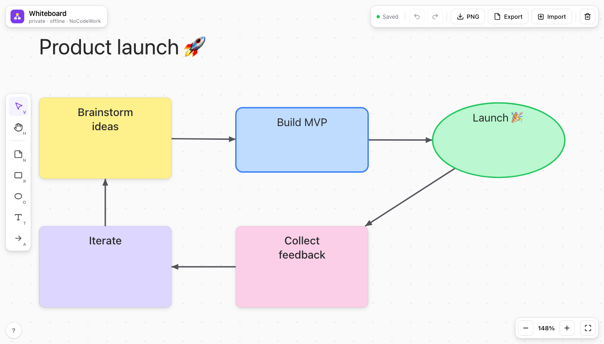

<div align="center">


# offline-whiteboard

A whiteboard that's just one HTML file. Open it, start drawing, done. No signup, no install, and nothing leaves your browser.

[](LICENSE)


**[Open the live demo](https://nocodework.github.io/offline-whiteboard/)** and use it right now, or [download `index.html`](https://raw.githubusercontent.com/nocodework/offline-whiteboard/main/index.html) and open it on any machine, even one with no internet.



</div>

## The idea

Most whiteboards make you create an account and push everything to their servers. That's useless on a work laptop with no internet, or one locked down by IT, which is usually exactly where I want to sketch a quick diagram.

This one is the opposite. It's a single file. You open it and it works. Whatever you draw is saved in your browser as you go, and none of it is sent anywhere. If you want to check, open your browser's Network tab and reload: the only thing that loads is the page itself.

One thing worth knowing up front: because your boards live in the browser, they're tied to that browser on that machine. For anything you actually care about, hit **Export** every now and then to save a real `.json` file you own. You can import it back later, or open it on another computer.

## What it does

- Sticky notes, rectangles, ellipses, and plain text
- Arrows that latch onto items and follow them when you move things around
- An infinite canvas you can pan and zoom
- Multi-select, resize, duplicate, an 8-color palette, and undo/redo
- Saves to the browser automatically, plus JSON import/export and PNG export

## Using it

The fastest way is to open the [live demo](https://nocodework.github.io/offline-whiteboard/) and go. If you want it offline, download `index.html` and double-click it. It's a static file, so you can also keep it on a USB stick, drop it on any web host, or `git clone` and open it. No server, no build step.

Grab the file from a terminal (this also works inside Claude Code or Codex):

```bash
curl -O https://raw.githubusercontent.com/nocodework/offline-whiteboard/main/index.html
open index.html      # macOS  ·  Linux: xdg-open index.html  ·  Windows: start index.html
```

## Keyboard shortcuts

| Key | Action | Key | Action |
|---|---|---|---|
| `V` | Select & move | `A` | Arrow (drag item to item) |
| `H` / `Space` | Pan view | double-click | Edit text, or make a new note |
| `N` | Sticky note | `⌫` | Delete selection |
| `R` `O` `T` | Rectangle / ellipse / text | `⌘Z` / `⌘⇧Z` | Undo / redo |
| wheel | Pan | `⌘`+wheel | Zoom |

## What's private about it

There's no backend, so there's nowhere for your data to go. No account, no cookies, no analytics, and no fonts pulled from a CDN. Your boards sit in your browser's local storage on your own device. Export saves a copy; Clear wipes everything. The whole thing is one readable file, so if you'd rather not take my word for it, open `index.html` and read it.

## How it works

Plain JavaScript, no libraries. The board draws to a single `<canvas>`, and a `<textarea>` pops up over it when you edit text (the same trick Excalidraw uses). PNG export reuses the same drawing code, so the file you get looks exactly like what's on screen. State is a small JSON object of `elements` and `connections`, saved to local storage.

```jsonc
{
  "app": "offline-whiteboard",
  "version": 1,
  "elements": [
    { "id": "n1", "type": "note", "x": 40, "y": 60, "w": 195, "h": 120, "text": "Idea", "color": "#FEF08A" }
  ],
  "connections": [
    { "id": "c1", "from": "n1", "to": "r1" }
  ]
}
```

## How it compares

|  | offline-whiteboard | Miro / FigJam | Excalidraw |
|---|:---:|:---:|:---:|
| Works with no internet | yes | no | needs PWA install |
| No account | yes | no | yes |
| Single file, no build | yes | no | no |
| Self-host in seconds | yes | no | takes setup |
| Open source | yes | no | yes |
| Real-time collaboration | no | yes | yes |

It's deliberately small: a whiteboard you fully own and can carry around in one file. If you need live multiplayer, Excalidraw or Miro will serve you better.

## Part of the offline series

offline-whiteboard is one of a small family of single-file, offline-first tools by NoCodeWork. Same idea every time: one HTML file, no account, no server, works offline.

- **offline-whiteboard** — you're here
- [**offline-notes**](https://github.com/nocodework/offline-notes) — a Markdown editor that renders as you type ([demo](https://nocodework.github.io/offline-notes/))

[](https://nocodework.github.io/offline-notes/)

## Contributing

Issues and pull requests are welcome, see [CONTRIBUTING.md](CONTRIBUTING.md). It's one file with no toolchain, so there's nothing to set up first.

## License

[MIT](LICENSE), by [NoCodeWork](https://nocodework.io). Do whatever you want with it.

---

<div align="center">
Built by <a href="https://nocodework.io">NoCodeWork</a>, where we make automation and AI apps for companies.
</div>
